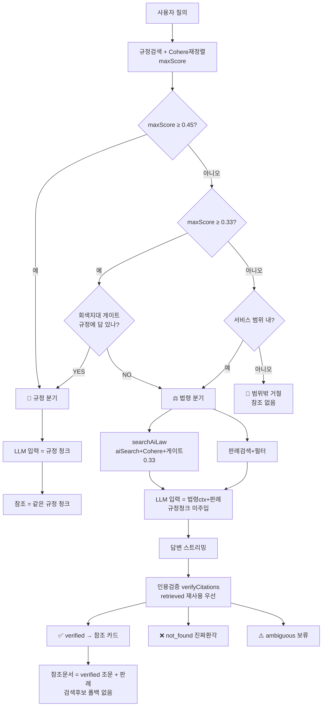

# ⑨ 챗봇 라우팅·참조문서 순서도

> 한 줄 요약: 질의가 들어오면 **내부 규정 → 법령 → 범위 밖** 중 하나로 갈라지고, 분기마다 **답변 근거(LLM 입력)** 와 **참조문서(화면 표시)** 가 어떻게 정해지는지를 그림으로 정리한 문서입니다.

> 기준 시점: 2026-06-30 (회색지대 적합성 게이트 도입 — 노이즈 규정청크의 규정↔법령 오라우팅 차단).
> 진실원 코드: `app/api/chat/route.ts`, `lib/db/search.ts`, `lib/ai/`, `lib/law/`.

> 용어 한 줄 정의
> - **분기(routing)**: 규정으로 답할지 법령으로 답할지를 관련도 점수로 자동 결정하는 단계.
> - **답변 근거(입력)**: LLM(Claude)에게 컨텍스트로 주입하는 자료. 답변이 "읽는" 것.
> - **참조문서(표시)**: 사용자 화면 우측 패널에 카드로 보이는 출처. 답변이 "쓴" 것.
> - **인용 검증**: 답변에 등장한 「법」 제N조를 법제처 공식 원문과 대조해 환각을 거르는 단계.

---

## 1. 전체 라우팅 순서도 (진입 → 3-way 분기)

```
                  사용자 질의 (마지막 user 메시지)
                            │
                  ┌─────────▼─────────┐
                  │ 입력검증·레이트리밋  │
                  └─────────┬─────────┘
                            │
            ① 내부 규정 검색 regulationSearch (후보 RETRIEVAL_TOP_K=30건)
                            │
            ② Cohere 재정렬 → 상위 RERANK_TOP_K=8건, maxScore = 1위 점수
                            │
                ┌───────────▼─────────────────┐
                │ maxScore ≥ 0.45 (GRAY_UPPER)? │
                └─────┬─────────────────┬───────┘
                  예 │ (자신있는 규정)    │ 아니오
                     │          ┌────────▼─────────────┐
                     │          │ maxScore ≥ 0.33 ?     │  (RELEVANCE_THRESHOLD)
                     │          └────┬────────────┬─────┘
                     │           예 │            │ 아니오 (규정 관련도 낮음)
                     │   ┌──────────▼──────────┐ │
                     │   │ 회색지대 적합성 게이트  │ │
                     │   │ isRegulationSufficient│ │
                     │   └────┬────────────┬────┘ │
                     │   YES │            │ NO    │
                     │  (규정에 답 있음)  (없음)    │
                     │      │             │       │
                     │      │      ┌──────▼───────▼──────┐
                     │      │      │ isInScope(질의)?      │ (범위 밖 분기는 < 0.33 일 때만)
                     │      │      └──────┬───────┬───────┘
                     │      │        예 │       │ 아니오
                     ▼      ▼           ▼       ▼
                  📘 규정 분기        ⚖️ 법령 분기   🚫 범위 밖
```

| 분기 | 조건 | 동작 |
|---|---|---|
| 📘 **규정** | maxScore ≥ 0.45, **또는** 0.33≤maxScore<0.45 이고 적합성 게이트 YES | 내부 규정으로 답변·참조 |
| ⚖️ **법령** | (maxScore < 0.33 이고 범위 내), **또는** 회색지대 게이트 NO | 법제처 법령·판례로 답변, 인용 검증으로 참조 |
| 🚫 **범위 밖** | maxScore < 0.33 **그리고** 범위 밖(잡담 등) | 근거 미주입 → 정중한 거절, 참조 없음 |

> 설계 메모: sufficiency 게이트는 한때 **모든 질의**에 돌려서 재정렬 청크 변동에 민감했고
> (같은 질의가 토큰 하나로 규정↔법령을 오감), 그래서 `e7a5ef2`에서 제거하고 점수 단일
> 기준만 썼다. 그러나 점수 단일 기준은 마진에서 불안정했다 — 노이즈 규정청크가 0.33을 근소하게
> (예: "기업 회생 절차와 방법" → 0.35) 넘겨 법령 질의를 규정으로 오라우팅했다. 현재는 게이트를
> **회색지대 `[0.33, 0.45)`에서만** 호출해 둘의 절충을 취한다 — 자신있는 고득점(≥0.45) 규정은
> 게이트 미호출(안정), 애매한 마진만 LLM이 "규정에 실제 답이 있나"로 재판정(정확). 게이트 실패
> 시 충분(규정 유지)으로 폴백. (커밋 `d32322c` 이후 회색지대 게이트 도입)

---

## 2. 📘 규정 분기 — 표시 = 사용 (단순)

```
규정 상위 8건 ──┬──► [LLM 입력]  답변 근거 = 이 규정 청크
               │
               └──► [참조문서]  같은 규정 청크 그대로 표시 (관련도 % 표시)
```

- 답변이 읽은 자료 = 화면에 보이는 참조 자료 → **항상 일치.**
- 규정 카드만 UI에 관련도 %를 표시한다(법령·판례 카드는 % 미표시).

---

## 3. ⚖️ 법령 분기 — 입력(검색) vs 출력(인용·검증) 분리 ★핵심

```
질의
 │
 ├─(병렬)─► searchAiLaw ────────────────────────────────┐
 │         · 법제처 aiSearch(조문 본문 의미검색)          │
 │         · Cohere 재정렬 + 결정론 보정                  │
 │             (+0.15 법령명-키워드 정합 / −0.05 시행령)   │
 │         · 노출 게이트: 1위 < 0.33 → 빈 결과(노이즈 차단) │
 │         반환: context(LLM 근거) + retrieved(조문맵)    │
 │                                                       │
 └─(병렬)─► searchDecisions(판례) → Cohere로 관련도 필터  │
                                                         │
        ┌────────────────────────────────────────────────┘
        ▼
   [LLM 입력]  lawContext = aiSearch 법령 + 판례
              ※ 규정 청크는 주입하지 않음 (진짜 이분법, answerDocs=[])
        │
        ▼
   답변 스트리밍 (Claude Sonnet 4.6) ──► 화면에 답변 출력
        │
        ▼
   verifyCitations(답변, retrieved)   ◄── 답변이 실제 인용한 「법」 제N조 추출
        │
        ├─ 인용이 retrieved(이미 검색됨)에 있나? ──예──► ✅ verified (법제처 재조회 X)
        │                                   └─아니오─► 법제처 조회 resolveLaw + fetchArticleMap
        │                                              ├─ 법+조문 실존 ─────► ✅ verified
        │                                              ├─ 법 실존·조문 없음 ─► ❌ not_found (진짜 환각)
        │                                              └─ 법령명 해석 실패 ──► ⚠️ ambiguous (검증 보류)
        ▼
   [참조문서] = verified 조문(citationSources) + 관련 판례   ← 이것만 표시
              ※ 검색 후보(법령 검색 결과 자체)는 표시하지 않음 / 노이즈 폴백 없음
```

### 3.1 게이트가 노이즈를 막는 이유

법제처 의미검색은 곁가지 법을 위로 올릴 수 있다. 예: "채권 우선순위/부도" 질의는
보증기금법·KAMCO 시행령을 0.23~0.27로 끌어온다. 규정 잣대(0.33)와 **동일한 문턱**을
적용해 1위조차 미달이면 법령을 비워, 답변이 곁가지 법을 권위 근거로 삼는 환각을 막는다.

### 3.2 검증 재사용 (법제처 재조회 회피)

`searchAiLaw`가 회수한 조문 본문은 이미 법제처 공식 데이터다. 그래서 답변이 인용한
(법, 조문)이 검색 결과 안에 있으면 **재조회 없이** verified 처리하고, 검색에 없던
인용(모델 지식 인용 등)만 법제처에 조회해 실존·환각을 판정한다.

### 3.3 거짓 환각 방지 (법령명 해석)

법제처 `lawSearch.do`는 무매칭 질의에 무관한 기본 목록을 반환할 때가 있다(예: "상법"
→ "1980년해직공무원…법" 1위). 이를 맹목 채택하면 인용이 엉뚱한 법으로 둔갑한다.
`resolveLaw`는 **후보명과 포함관계가 있는 후보만** 채택하고, 해석 실패는 `not_found`
(환각)가 아니라 `ambiguous`(검증 보류)로 처리해 **거짓 환각 경고**를 막는다.
(실존 법의 없는 조문은 여전히 `not_found`로 진짜 환각을 잡는다.)

---

## 4. 참조문서 ↔ 답변 로직 (분기별 대비)

| | 📘 규정 분기 | ⚖️ 법령 분기 |
|---|---|---|
| **답변 근거(입력)** | 규정 상위 8건 | aiSearch 법령 context + 판례 |
| **참조문서(표시)** | 같은 규정 청크 | **답변이 인용·검증한 조문만** |
| **검색 결과의 역할** | 입력 = 표시 (동일) | 입력 **전용** (표시 안 함) |
| **불일치 가능성** | 없음 | 검색이 곁가지 법을 찾아도 → 표시는 답변 인용만 → **노이즈 차단** |
| **환각 방지** | — | 인용 조문을 법제처 실존 대조 |

**핵심 원리**: 법령 분기에서 **검색(`searchAiLaw`) = LLM이 읽는 입력**, **참조문서 =
답변이 실제 쓴 것(`citationSources`)**. 둘을 분리했기 때문에, 검색이 곁가지 법을
끌어와도 답변이 그걸 인용하지 않으면 참조에 안 뜬다. 이 통합으로 "검색 후보를 참조로
폴백"하던 경로를 없애 **답변≠참조 불일치와 노이즈를 동시에 제거**했다. (커밋 `d32322c`)

---

## 5. mermaid (GUI 뷰어용)



---

## 6. 코드 포인터

| 단계 | 위치 |
|---|---|
| 진입·분기·스트리밍·표시 | `app/api/chat/route.ts` `POST` |
| 규정 검색 | `lib/db/search.ts` `regulationSearch` |
| 규정 재정렬 | `app/api/chat/route.ts` `topRerankedSources` → `lib/ai/rerank.ts` |
| 회색지대 적합성 게이트 | `lib/ai/llm-router.ts` `isRegulationSufficient` |
| 범위 게이트 | `lib/ai/llm-router.ts` `isInScope` |
| 법령 검색·게이트·retrieved | `lib/law/search.ts` `searchAiLaw` |
| 판례 검색·필터 | `lib/law/decisions.ts` + `route.ts` 판례 재정렬 |
| 인용 검증·재사용·해석 | `lib/law/verify.ts` `verifyCitations` / `resolveLaw` |
| 참조 카드 렌더 | `components/ui/source-panel.tsx`, `app/page.tsx` `Sources` |

## 7. 주요 상수

| 상수 | 기본값 | 의미 |
|---|---|---|
| `RETRIEVAL_TOP_K` | 30 | 규정 1차 검색 후보 수 |
| `RERANK_TOP_K` | 8 | Cohere 재정렬 후 LLM 근거로 쓸 규정 수 |
| `RELEVANCE_THRESHOLD` | 0.33 | 규정↔법령 분기 하한 + 법령 노출 게이트 + 판례 필터의 공통 문턱 |
| `RELEVANCE_GRAY_UPPER` | 0.45 | 회색지대 상한. `[0.33, 0.45)`에서만 적합성 게이트 호출(노이즈 규정청크 오라우팅 차단) |
