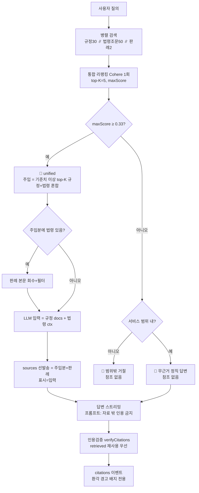

# ⑨ 챗봇 통합 검색·참조문서 순서도

> 한 줄 요약: 질의가 들어오면 **내부 규정과 법제처 법령을 병렬로 찾아 하나의 풀에서 관련도로 줄 세운 뒤**, 기준치 이상인 상위 근거만 답변에 주입하고 **주입분을 그대로 참조문서로 보여 주는**(표시=입력) 구조를 그림으로 정리한 문서입니다.

> 기준 시점: 2026-07-14 (**통합 검색 개편 + 복합 질의 의도 분해** — 이분법 분기 폐지, 단일 풀 리랭킹, 의도별 검색·리랭킹 도입).
> 진실원 코드: `app/api/chat/route.ts`, `lib/db/search.ts`, `lib/ai/`, `lib/law/`.

> 용어 한 줄 정의
> - **통합 리랭킹**: 규정 청크와 법령 조문을 한 풀에 넣고 Cohere 로 1회 재정렬해 같은 잣대의 관련도 점수를 매기는 단계.
> - **주입(입력)**: LLM(Claude)에게 컨텍스트로 넣는 자료. 답변이 "읽는" 것.
> - **참조문서(표시)**: 사용자 화면 우측 패널에 카드로 보이는 출처. **주입분과 동일**(표시=입력).
> - **인용 검증**: 답변에 등장한 「법」 제N조를 법제처 공식 원문과 대조해 환각을 경고하는 단계(배지 전용).

---

## 1. 전체 순서도

```
                  사용자 질의 (마지막 user 메시지)
                            │
                  ┌─────────▼─────────┐
                  │ 입력검증·레이트리밋  │
                  └─────────┬─────────┘
                            │
        ① 병렬 검색 (벽시계 = 최장 1개, 법령·판례·분해는 best-effort)
           ├─ regulationSearch        내부 규정 후보 ≤30건 (hybrid+RRF)
           ├─ fetchAiLawCandidates    법제처 aiSearch 조문 후보 ≤50건 (원시, 재정렬 없음)
           ├─ searchDecisions         판례 목록 2건 (투기적 — 뒤에서 조건부 소비)
           └─ decomposeIntents        의도 분해 (Haiku) — 검색 목적이 2개 이상 섞인
                                      복합 질의만 하위 의도 2~3개로 분해(아니면 [])
                            │
        ①-b (복합 의도만) 의도별 검색 추가 발사
           의도마다 regulationSearch(의도) ∥ fetchAiLawCandidates(의도)
           — 지배 의도(예: 기금 어휘)가 법제처 의미검색을 독점해 부차 의도 법령
             (예: 채무자회생법)이 후보에 못 드는 문제를 의도 단위 회수로 해소
                            │
        ② 통합 리랭킹 (Cohere rerank-v3.5)
           · 단일 의도: 원질의 기준 1콜 → 순수 점수순 top-K(RERANK_TOP_K=5),
             주입 = score ≥ 0.33 만 (기존 경로 그대로)
           · 복합 의도: 의도별 풀(의도 후보 + 원질의 후보 합류)을 "그 의도 질의"
             기준으로 재정렬 — 부차 의도 조문이 원질의 전체와 대조되어 저평가되는
             것(실측 0.05~0.16)을 복원. 선발(B안): 의도별 상위 2건은 완화 문턱
             (RELEVANCE_INTENT_FLOOR=0.25), 이후는 0.33. 의도별 상한
             max(2, ⌈K/의도수⌉), 의도 순서 인터리브 병합(교차 중복은 고점 유지).
             **명시 법령 한정**: 의도 질의에 법령 정식명칭이 있으면 그 의도의 법령
             픽을 그 법령(본법+시행령·시행규칙) 조문으로 한정 — 법령명을 '언급만'
             하는 곁가지 조문(어휘 밀도로 고득점)의 상위 독점 차단
           maxScore = 전 의도 1위 중 최대 / 근거 없음 판정 = 선발 0건
                            │
              ┌─────────────▼──────────────┐
              │ maxScore ≥ 0.33 ?           │ (RELEVANCE_THRESHOLD)
              └──────┬──────────────┬───────┘
                 예 │              │ 아니오 (근거 없음)
                    │       ┌──────▼───────┐
                    │       │ isInScope ?   │ (범위 게이트 — LLM YES/NO)
                    │       └───┬──────┬────┘
                    │       예 │      │ 아니오
                    ▼          ▼      ▼
              🔀 통합(unified)  📄 무근거    🚫 범위 밖
              주입 = 규정+법령   정직 답변    거절(참조 없음)
              혼합 top-K        (참조 없음)
```

| 라우트 | 조건 | 동작 |
|---|---|---|
| 🔀 **unified** | maxScore ≥ 0.33 | 기준치 이상 top-K(규정+법령 혼합)를 주입·표시. 법령 포함 시 판례 보강 |
| 📄 **무근거(unified)** | maxScore < 0.33 이고 범위 내 | 근거 미주입 → "확인된 자료 없음" 정직 답변, 참조 없음 |
| 🚫 **out_of_scope** | maxScore < 0.33 이고 범위 밖(잡담 등) | 근거 미주입 → 정중한 거절, 참조 없음 |

> 설계 메모: 과거(2026-06)의 **규정/법령 이분법 분기**(maxScore·회색지대 게이트로 어느 한쪽만 주입)는
> "규정이 법령을 위임·인용해 **둘 다 근거가 필요한 질의**"에서 한쪽 근거를 버리는 문제가 있어
> 2026-07-13 폐지했다. 회색지대 적합성 게이트(`isRegulationSufficient`)와 `RELEVANCE_GRAY_UPPER` 도
> 함께 제거 — 라우팅 자체가 사라져 게이트가 필요 없다. 곁가지 법령 억제는 이제
> **규정 청크와의 직접 경쟁 + 주입 항목별 기준치 필터**가 담당한다.

---

## 2. 주입·표시 = 단일 원칙 (표시=입력)

```
통합 top-K (score ≥ 0.33)
   ├─ 규정 청크 ──► [LLM 입력] retrievedDocs ([내부 규정] 섹션)
   │               [참조문서] 같은 청크 + 관련도 %
   ├─ 법령 조문 ──► [LLM 입력] lawContext ([법령·판례] 섹션, 관련도 % 포함)
   │               [참조문서] 같은 조문 + 관련도 % (id 음수 대역 -(200+i))
   │
   └─ (주입분에 법령이 있으면) 판례 본문 회수 → Cohere 필터(≥0.33) 통과분만
                  [LLM 입력] lawContext 에 [관련 판례] 블록 추가
                  [참조문서] 판례 카드 + 관련도 % (id -(100+i))
```

- 답변이 읽은 자료 = 화면에 보이는 참조 자료 → **항상 일치**. 카드 순서는 통합 점수순(규정·법령 혼합).
- `sources` 이벤트는 서버가 **답변 스트리밍 전에** 발송하지만(중단 시 데이터 유실 방지 — docs/08 이슈 A),
  **화면 표시는 답변 생성 완료 후**에 한다(`app/page.tsx` revealSources). '멈춤' 시에도 이미 수신한
  참조문서를 부분 답변에 붙여 표시한다 — 전송 시점(서버)과 표시 시점(클라이언트)의 분리.
- 과거의 "법령 분기는 인용·검증된 조문만 표시"(`citationSources`) 규칙은 폐지 — 인용 검증은 표시를 결정하지 않는다.

---

## 3. 환각 차단 2중 장치

```
[1차 — 프롬프트 강제]  시스템 프롬프트(advisor):
    "법령·조문 인용은 제공된 자료에 실린 것만. 자료 밖 조문 번호를 기억으로 인용 금지."
        │
        ▼
   답변 스트리밍 완료
        │
        ▼
[2차 — 인용 검증 verifyCitations(답변, lawCand.retrieved)]  ※ 범위 밖 제외 전 답변 실행
        │
        ├─ 인용이 검색 후보(retrieved 맵, 주입 여부 무관 전체)에 있나? ──예──► ✅ verified (법제처 재조회 X)
        │                                   └─아니오─► 법제처 조회 resolveLaw + fetchArticleMap
        │                                              ├─ 법+조문 실존 ─────► ✅ verified
        │                                              ├─ 법 실존·조문 없음 ─► ❌ not_found (진짜 환각)
        │                                              └─ 법령명 해석 실패 ──► ⚠️ ambiguous (검증 보류)
        ▼
   citations 이벤트 → hasHallucination 이면 답변 하단에 경고 배지
   (참조 카드와 무관 — 배지 전용. 인용 0건이면 법제처 호출 0회)
```

- 인용 추출 정규식은 마크다운 강조(`**제19조**`)와 "…에 관한 **규정**" 접미사도 처리한다.
  무변별 단독 토큰("규정 제N조")은 오검증 방지 위해 스킵.
- 1차(자료 밖 인용 금지)를 지키는 답변의 인용은 대부분 retrieved 재사용으로 무비용 검증되고,
  1차를 어긴 인용(모델 지식 인용)만 법제처 조회 — **위반 감지가 곧 환각 감지**다.

---

## 4. mermaid (GUI 뷰어용)



---

## 5. 코드 포인터

| 단계 | 위치 |
|---|---|
| 진입·병렬검색·통합리랭킹·스트리밍·표시 | `app/api/chat/route.ts` `POST` |
| 의도 분해 게이트 (Haiku) | `lib/ai/llm-router.ts` `decomposeIntents` + `prompts/prompts.md` intent-decompose |
| 규정 검색 | `lib/db/search.ts` `regulationSearch` |
| 법령 후보 공급 (원시, 재정렬 없음) | `lib/law/search.ts` `fetchAiLawCandidates` |
| 통합 리랭킹 | `app/api/chat/route.ts` `rerankUnifiedPool` → `lib/ai/rerank.ts` |
| 범위 게이트 | `lib/ai/llm-router.ts` `isInScope` |
| 판례 검색·필터 | `lib/law/decisions.ts` + `route.ts` 판례 재정렬 |
| 인용 검증·재사용·해석 | `lib/law/verify.ts` `verifyCitations` / `resolveLaw` |
| 자료 기반 답변 강제 | `prompts/prompts.md` advisor 섹션 [근거 사용 원칙] |
| 참조 카드·환각 배지 렌더 | `components/ui/source-panel.tsx`, `app/page.tsx` |
| 통합 리랭킹 진단 스크립트 | `scripts/test-route-decision.ts` |

## 6. 주요 상수

| 상수 | 기본값 | 의미 |
|---|---|---|
| `RETRIEVAL_TOP_K` | 30 | 규정 1차 검색 후보 수 |
| `RERANK_TOP_K` | 8 (.env.local 5) | 통합 리랭킹 후 LLM 근거로 쓸 최대 건수 |
| `RELEVANCE_THRESHOLD` | 0.33 | ①근거없음 판정 ②주입 항목별 바닥 ③판례 필터의 공통 문턱 |
| `RELEVANCE_INTENT_FLOOR` | 0.25 | 복합 의도 시 의도별 상위 2건에만 적용하는 완화 문턱(B안) |
| `INTENT_MODEL` | claude-haiku-4-5 | 의도 분해 게이트 전용 소형 모델(답변 LLM 과 분리) |

## 7. 관찰 항목 (개편 후 튜닝 근거)

- `query_log.retrieved` 에 주입 카드 [{id, score}] 가 남는다(법령은 음수 id). **규정 청크 vs 법령 조문의
  점수 분포 차이**(길이·문체 기인)가 한쪽을 체계적으로 밀어내는지 이 데이터로 관찰 후 문턱을 조정한다.
- `below_threshold` 의 의미가 "규정 최고점 미달"→"**통합** 최고점 미달"로 바뀌었다(2026-07-13 이후 행).
- 매 질의 법제처 aiSearch 왕복이 추가됐다(병렬·6h 캐시·실패 시 규정 단독 강등). `retrieval_ms` 로 추적.
